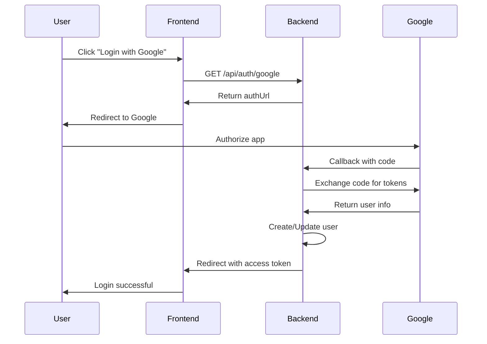

# Google OAuth Setup Guide

## 🚀 Hướng dẫn thiết lập Google OAuth

### 1. Tạo Google Cloud Project

1. Truy cập [Google Cloud Console](https://console.cloud.google.com/)
2. Tạo project mới hoặc chọn project hiện có
3. Đi tới **APIs & Services** > **Credentials**

### 2. Tạo OAuth 2.0 Credentials

1. Click **Create Credentials** > **OAuth 2.0 Client IDs**
2. Chọn **Web application**
3. Đặt tên cho credential (VD: "HostFileDrive OAuth")
4. Thêm **Authorized JavaScript origins**:
   - `http://localhost:3000`
   - `http://localhost:3001` (frontend)
5. Thêm **Authorized redirect URIs**:
   - `http://localhost:3000/api/auth/google/callback`
6. Click **Create**

### 3. Cấu hình môi trường

Cập nhật file `.env`:
```bash
GOOGLE_CLIENT_ID=your_actual_client_id_here
GOOGLE_CLIENT_SECRET=your_actual_client_secret_here
GOOGLE_REDIRECT_URI=http://localhost:3000/api/auth/google/callback
```

### 4. API Endpoints

#### 4.1 Khởi tạo Google Login
```
GET /api/auth/google
```
Response:
```json
{
  "success": true,
  "data": {
    "authUrl": "https://accounts.google.com/oauth/authorize?..."
  }
}
```

#### 4.2 Callback xử lý (tự động)
```
GET /api/auth/google/callback?code=...&state=...
```
- Redirect đến frontend với token khi thành công
- Redirect đến trang lỗi khi thất bại

#### 4.3 Liên kết tài khoản Google (cho user đã đăng nhập)
```
POST /api/auth/link-google
Authorization: Bearer {access_token}
{
  "code": "google_authorization_code"
}
```

#### 4.4 Hủy liên kết tài khoản Google
```
DELETE /api/auth/unlink-google
Authorization: Bearer {access_token}
```

### 5. Flow đăng nhập Google



### 6. Frontend Integration Example

```javascript
// Khởi tạo Google Login
const initiateGoogleLogin = async () => {
  try {
    const response = await fetch('/api/auth/google');
    const data = await response.json();
    
    if (data.success) {
      // Redirect user to Google OAuth
      window.location.href = data.data.authUrl;
    }
  } catch (error) {
    console.error('Error initiating Google login:', error);
  }
};

// Xử lý callback (trong component callback)
const handleAuthCallback = () => {
  const urlParams = new URLSearchParams(window.location.search);
  const token = urlParams.get('token');
  const success = urlParams.get('success');
  
  if (success === 'true' && token) {
    // Store token và redirect to dashboard
    localStorage.setItem('accessToken', token);
    window.location.href = '/dashboard';
  } else {
    // Handle error
    const error = urlParams.get('error');
    console.error('OAuth error:', error);
  }
};
```

### 7. Testing

Chạy test để kiểm tra setup:
```bash
npm run test:google
```

### 8. Troubleshooting

#### Lỗi "redirect_uri_mismatch"
- Đảm bảo redirect URI trong Google Console khớp với `GOOGLE_REDIRECT_URI`

#### Lỗi "invalid_client"
- Kiểm tra `GOOGLE_CLIENT_ID` và `GOOGLE_CLIENT_SECRET`

#### Lỗi "access_denied"
- User từ chối cấp quyền hoặc credentials không đúng

### 9. Production Setup

Khi deploy production:
1. Thêm domain production vào Authorized origins
2. Thêm production callback URL vào Authorized redirect URIs
3. Cập nhật environment variables cho production

Example production URLs:
- Origins: `https://yourdomain.com`
- Redirect URI: `https://yourdomain.com/api/auth/google/callback`
